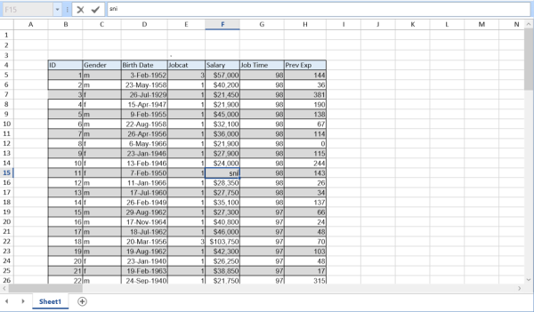

# How to Load WPF Spreadsheet Inside the StackPanel?

This example demonstrates how to load the [WPF Spreadsheet](https://www.syncfusion.com/spreadsheet-editor-sdk/wpf-spreadsheet-editor) (SfSpreadsheet) control inside the stack panel.

`StackPanel` is a type of container which can keep on growing as many as children. We added into it and provide equal space for each of its children. So, the `ScrollViewer` require height and width to define the space limit of `Spreadsheet` control.

``` xml
<StackPanel>
 <Grid Height="750" Width="1000">
  <Grid.RowDefinitions>
     <RowDefinition Height="70"/>
     <RowDefinition Height="auto"/>
     <RowDefinition Height="*"/>
  </Grid.RowDefinitions>
  <Button Content="Load" Grid.Row="0" VerticalAlignment="Top" Width="100" 
          Click="Button_Click" HorizontalAlignment="Left" Margin="10"/>
  <syncfusion:SfSpreadsheetRibbon Grid.Row="1"  
                                syncfusion:SkinStorage.VisualStyle="office2010lBlue"/>
  <syncfusion:SfSpreadsheet Name="spreadsheet" Grid.Row="2" Visibility="Hidden"/>
 </Grid>
</StackPanel>
```


